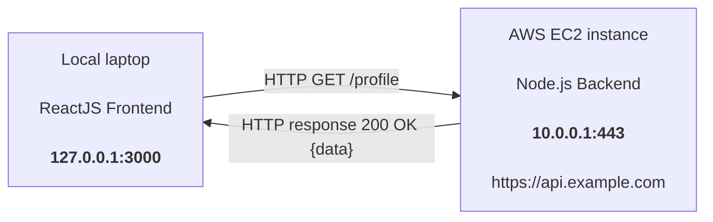
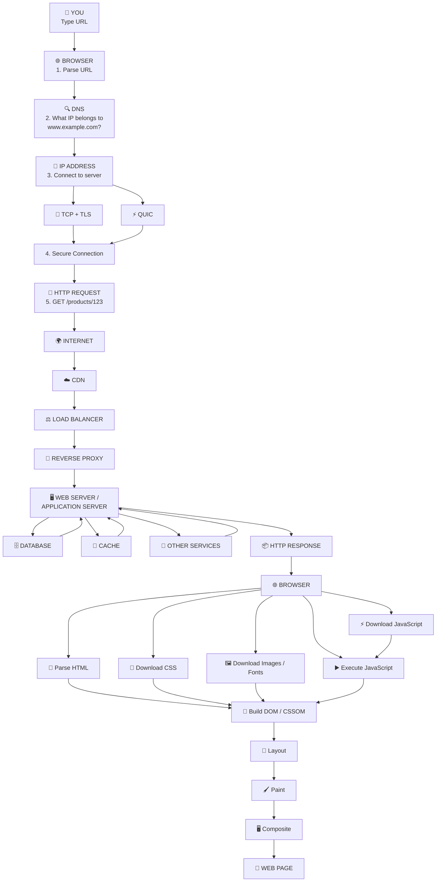

# Introduction

## Local ReactJS Frontend → AWS EC2 Node.js Backend



- **127.0.0.1:3000** as Source IP
- **10.0.0.1:443** as Destination IP (This is public availble)
- const res = await fetch("https://api.example.com/profile")
- What it Do
- Domain Name System(DNS) takes the host name (here - api.example.com) -> convert it to it's public IP address(Here : 10.0.0.1).
- Source Ip : 127.0.0.1
- Source port :3000
- Destination IP : 10.0.0.1
- Destination Port : 443
- When Browser See a https, then the port will be 443


# Big Picture
# What Happens When You Enter a URL?


## URL anatomy
```
https://www.example.com:443/products/123?color=red#reviews
  │          │          │       │              │
  │          │          │       │              └── 🔖 Fragment
  │          │          │       └── ❓ Query string
  │          │          └── 📁 Path
  │          └── 🔌 Port
  └── 🔒 Scheme
```
## Host Break down
```
www.example.com
 │      │      │
 │      │      └── 🏷️ TLD
 │      └── 🏢 Domain
 └── 🔗 Subdomain
```
## Default Ports
```
Protocol	Port
HTTP	     80
HTTPS	    443 
```
## 2. Browser Cache Check
```
🌐 BROWSER CACHE
 │
 ├── 🔍 DNS information
 ├── 📄 HTTP cached responses
 ├── 🔐 TLS/session information
 ├── ⚙️ Service worker
 └── 📦 Previously downloaded resources
```
- If www.example.com → 93.184.216.34 is cached → no fresh DNS lookup needed.
## 3. DNS — Domain → IP
- DNS is the Internet's phone book.
```
🌐 Domain Name              🔍 DNS              📍 IP Address
www.example.com    ──────►  [ lookup ]  ──────►  93.184.216.34
```
- Computers don't communicate using www.example.com — they use IP addresses.

## 4. Where Does the DNS Request Go?
```
💻 LAPTOP
   │ DNS query
   ▼
🔍 DNS RESOLVER
   │
   ├── 🏠 Provided by router
   ├── 📡 Provided by ISP
   ├── ☁️ Public DNS (8.8.8.8, 1.1.1.1)
   ├── 🏢 Enterprise DNS
   └── 🔐 Encrypted (DoH / DoT)
```
```
💻 LAPTOP ──► "What is www.example.com?" ──► 🔍 DNS RESOLVER
                                                 │
                                          ┌──────┴──────┐
                                          ▼             ▼
                                    ✅ Cached     ❌ Not cached
                                    Return IP     Find answer
```
## 5. DNS Hierarchy
```
              🌍 ROOT
                 │
                 ▼
              🏷️ .com
                 │
                 ▼
           🏢 example.com
                 │
                 ▼
        🔗 www.example.com
```
- Resolution Chain
```
🔍 Resolver: "Who handles .com?"
🌍 Root:     "Ask .com nameservers."
                  │
                  ▼
🔍 Resolver: "Who handles example.com?"
🏷️ .com NS:  "Ask example.com's authoritative nameservers."
                  │
                  ▼
🔍 Resolver: "What is www.example.com?"
📋 Auth NS:  "93.184.216.34"
                  │
                  ▼
💻 Your Computer ◄──── IP address
```
## 6. DNS Records
```
Record	     Purpose	                    Example
A	       Hostname → IPv4	          www.example.com → 93.184.216.34
AAAA	   Hostname → IPv6	          www.example.com → 2606:2800:220:1:...
CNAME	   Alias → another hostname	  www.example.com → example.cdn-provider.com
MX	       Mail exchange	          example.com → mail.example.com
TXT	       Text data	              SPF, DKIM, verification
NS	       Nameserver	              example.com → ns1.example.com
```
- **CNAME FLOW**
🔗 www.example.com ──► ☁️ example.cdn-provider.com ──► 📍 IP address
### FULL DNS architecture
```
🌐 Browser
   │
   ▼
🔍 DNS Resolver
   │
   ▼
🌍 Root
   │
   ▼
🏷️ .com Nameserver
   │
   ▼
📋 Authoritative DNS
   │
   ▼
📍 IP Address
```
## 7. DNS Caching
```
www.example.com
93.184.216.34
⏱️ TTL = 300 seconds (5 minutes)
```
- TTL  : Time To Live.
- It means: "You can cache the answer www.example.com → 93.184.216.34 for 300 seconds."
- 🌐 Browser ──► 🔍 DNS Cache ──► 📍 93.184.216.34  (no external lookup)
- Why? Prevents every request from traversing the entire DNS hierarchy.
## 8–9. Network Stack
```
📱 APPLICATION
     │
     ▼
📨 HTTP
     │
     ▼
🔐 TLS
     │
     ▼
🔌 TCP / ⚡ QUIC
     │
     ▼
🌐 IP
     │
     ▼
📡 ETHERNET / WI-FI
     │
     ▼
🔧 NETWORK HARDWARE
```
- Each layer has a specific job.
## 10. HTTP
- HTTP's job: "What are we asking the server for?"
```
http
GET /products/123 HTTP/2
Host: www.example.com
Accept: text/html
Accept-Language: en-US
User-Agent: Mozilla/5.0...
Cookie: session=abc123
```
- HTTP doesn't care how packets travel — it only defines request/response semantics.
## 11. TCP
- TCP = Transmission Control Protocol.
- TCP is a protocol that allows two computers to reliably exchange data over a network.
- Think of TCP as a reliable delivery service 📦:
- "I will make sure your data arrives, in the correct order, without missing pieces."
- Simple example : When your browser connects to a web server:
```
🌐 Browser                         🖥️ Server
    │                                  │
    │────── TCP connection ───────────►│
    │                                  │
    │────── Data packet 1 ───────────►│
    │────── Data packet 2 ───────────►│
    │────── Data packet 3 ───────────►│
    │                                  │
    │◄────── Acknowledgements ─────────│
    │                                  │
    │◄────── Data ─────────────────────│
```
- Traditional HTTPS Stack
```
📨 HTTP
  ↓
🔐 TLS
  ↓
🔌 TCP
  ↓
🌐 IP
```
### TCP Provides
```
Feature	                 Meaning
✅ Reliable delivery	Data arrives
📏 Ordering	            Correct sequence
🔄 Retransmission	    Resends lost packets
🚦 Flow control	        Protects receiver
🛣️ Congestion control	Adapts to network
```
```
📦 Packet 1 ✅
📦 Packet 2 ✅
📦 Packet 3 ❌ LOST ──► 🔄 Retransmitted
📦 Packet 4 ✅
```
## 12. QUIC / HTTP/3
- Two Major Paths
```
┌────────────────────┐         ┌────────────────────┐
│  HTTP/1.1 & HTTP/2 │         │      HTTP/3        │
├────────────────────┤         ├────────────────────┤
│      📨 HTTP       │         │      📨 HTTP       │
│        ↓           │         │        ↓           │
│      🔐 TLS        │         │      ⚡ QUIC       │
│        ↓           │         │        ↓           │
│      🔌 TCP        │         │      📡 UDP        │
│        ↓           │         │        ↓           │
│      🌐 IP         │         │      🌐 IP         │
└────────────────────┘         └────────────────────┘
```
## 13. Gateway
```
💻 LAPTOP                📡 ROUTER              🌍 INTERNET         🖥️ SERVER
192.168.1.20    ──────►  192.168.1.1    ──────►  [ ... ]    ──────► 93.184.216.34
```
- Laptop says: "93.184.216.34 isn't on my local network → send to default gateway."
## 14. ARP / NDP
### IPv4 — ARP
```
💻 LAPTOP (192.168.1.20)          📡 ROUTER (192.168.1.1)
       │                                   │
       │ 📢 "Who has 192.168.1.1?" (broadcast)
       │──────────────────────────────────►│
       │                                   │
       │ ◄──── "It's me. MAC: AA:BB:CC:DD:EE:FF"
       │                                   │
```
- Now the laptop can build an Ethernet/Wi-Fi frame addressed to the router.
- IPv6 uses Neighbor Discovery (NDP) instead of ARP.
## 15. Packet Encapsulation
- Mental Model: Nested envelopes — each layer adds its own headers.
```
┌─────────────────────────────────────┐
│ 📦 ETHERNET FRAME                   │
│  ┌───────────────────────────────┐  │
│  │ 🌐 IP PACKET                  │  │
│  │  ┌─────────────────────────┐  │  │
│  │  │ 🔌 TCP SEGMENT          │  │  │
│  │  │  ┌───────────────────┐  │  │  │
│  │  │  │ 🔐 TLS            │  │  │  │
│  │  │  │  ┌─────────────┐  │  │  │  │
│  │  │  │  │ 📨 HTTP     │  │  │  │  │
│  │  │  │  │  REQUEST    │  │  │  │  │
│  │  │  │  └─────────────┘  │  │  │  │
│  │  │  └───────────────────┘  │  │  │
│  │  └─────────────────────────┘  │  │
│  └───────────────────────────────┘  │
└─────────────────────────────────────┘
```
## 16. TCP Three-Way Handshake
```
💻 CLIENT                              🖥️ SERVER
    │                                      │
    │ ─── SYN ──────────────────────────►  │  "I'd like to connect"
    │                                      │
    │ ◄───────────── SYN-ACK ────────────  │  "Received, I'm ready"
    │                                      │
    │ ─── ACK ──────────────────────────►  │  "Confirmed"
    │                                      │
    │        ✅ TCP CONNECTION OPEN        │
```
## 17. TLS Handshake
```
🌐 BROWSER                              🖥️ SERVER
    │                                      │
    │ ─── ClientHello ──────────────────►  │
    │                                      │
    │ ◄───────────── ServerHello ────────  │
    │ ◄───────────── Certificate ────────  │
    │ ◄───────────── TLS parameters ─────  │
    │                                      │
    │ ─── Key exchange ─────────────────►  │
    │                                      │
    │ ◄═══════ 🔐 ENCRYPTED ═══════════►   │
```
- Typically TLS 1.3 today.
## 18. Why Does the Server Send a Certificate?
- Scenario: You typed https://bank.example — how do you know it's actually the bank?
```
🌐 BROWSER
   │ "Does this certificate belong to bank.example?"
   ▼
📜 CERTIFICATE
   │
   ▼
🏢 INTERMEDIATE CA
   │
   ▼
🏛️ ROOT CA
```
-  If validation fails → browser shows a certificate warning.
## 19. TLS Encrypts HTTP Traffic
- Before (HTTP — visible)
```
GET /profile
Host: example.com
```
- After (HTTPS — encrypted)
```
8F A2 91 72 4C 8A ...
```
### What an Observer Can Still See
```
Visible	               Hidden
📍 Source IP	     📨 HTTP contents
📍 Destination IP	 🔐 Headers / body
📦 Packet sizes	     🍪 Cookies
⏱️ Timing	
🔌 Port
```
## 20. HTTP Request
```
GET /products/123 HTTP/2
Host: www.example.com
Accept: text/html
Accept-Language: en-US
User-Agent: Mozilla/5.0...
Cookie: session=abc123
Accept-Encoding: gzip, br, zstd
Cache-Control: no-cache
Referer: https://www.example.com/
Authorization: Bearer ...
```
- Accept-Encoding tells the server: "I understand compressed responses."
## 21. Where Does the Request Actually Go?
```
                       🌍 INTERNET
                           │
                           ▼
                        ☁️ CDN
                           │
                           ▼
                    ⚖️ LOAD BALANCER
                           │
                           ▼
                    🔄 REVERSE PROXY
                           │
                 ┌─────────┴─────────┐
                 ▼                   ▼
            🖥️ WEB SERVER       🖥️ WEB SERVER
                 │                   │
                 └─────────┬─────────┘
                           ▼
                    ⚙️ APPLICATION
                           │
              ┌────────────┼────────────┐
              ▼            ▼            ▼
          🔴 REDIS    🗄️ DATABASE   🔌 OTHER APIs
```
- This is extremely common in modern web infrastructure.
## 22. CDN — Content Delivery Network
```
🇮🇪 USER IN IRELAND ──► ☁️ NEARBY CDN ──► 📦 CACHED CONTENT
```
instead of
```
🇮🇪 IRELAND ────────── thousands of km ──────────► 🇺🇸 US SERVER
```
## CDN Benefits
```
Benefit	        Icon
Cached images	🖼️
JavaScript	    ⚡
CSS	            🎨
Videos	       🎥
Fonts	       🔤
Static HTML	   📄
API acceleration	🚀
DDoS protection	   🛡️
```
## 23. Load Balancer
```
                    ⚖️ LOAD BALANCER
                    /       |       \
                   ▼        ▼        ▼
              🖥️ SRV 1  🖥️ SRV 2  🖥️ SRV 3
```
```
Request	    Routed to
Request 1	Server 1
Request 2	Server 2
Request 3	Server 3
Request 4	Server 1
```
## 24. Reverse Proxy
```
🌍 INTERNET ──► 🔄 NGINX ──► ⚙️ NODE.JS
```
- Client thinks it's talking to example.com, but internally: Nginx → Node.js.
### Common Reverse Proxies
```
  Tool	     Description
🔄 Nginx	Popular web server / reverse proxy
⚡ HAProxy	High-performance LB
🌐 Envoy	Modern service proxy
☁️ Cloud LB	AWS ALB, GCP LB, Azure LB
```
## 25. Node.js Backend Receives the Request
```
app.get("/profile", (req, res) => {
    res.json({
        name: "Alice",
        age: 25
    });
});
```
```
⚙️ NODE.JS
   │ "SELECT ..."
   ▼
🗄️ POSTGRESQL
   │
   │ Response: Alice, 25
   ▼
⚙️ NODE.JS ──► 📨 HTTP RESPONSE
```
## 26. HTTP Response
```
HTTP/1.1 200 OK
Content-Type: application/json

{
    "name": "Alice",
    "age": 25
}
```
### Response Path
```
🗄️ DATABASE
   │
   ▼
⚙️ NODE.JS
   │
   ▼
🔄 REVERSE PROXY
   │
   ▼
⚖️ LOAD BALANCER
   │
   ▼
☁️ CDN / 🌍 INTERNET
   │
   ▼
📡 ROUTER
   │
   ▼
💻 LAPTOP
   │
   ▼
🌐 BROWSER
```
- Return packets may take a different physical route than outgoing ones.
## 27. Routing Through the Internet
```
💻 LAPTOP ──► 📡 ROUTER A ──► 📡 ROUTER B ──► 📡 ROUTER C ──► 📡 ROUTER D ──► 🖥️ SERVER
```
### Routing Table Example
```
Destination	     Next Hop
10.0.0.0/8	      ...
172.16.0.0/12	  ...
192.168.0.0/16	  ...
93.184.216.0/24	Router X
0.0.0.0/0	    Default router
```
- Router asks: "Which interface should I send this packet through?"
## 28. BGP — Border Gateway Protocol
```
☁️ AWS ──► "advertises IP prefixes" ──► 🌍 INTERNET ──► 📡 Other Autonomous Systems
                                                         │
                                                         ▼
                                            📋 Routing Tables Updated
```
- BGP is how networks find paths to other networks. This is why the Internet scales.
## 29. NAT — Network Address Translation
```
💻 LAPTOP                       📡 ROUTER / NAT              🌍 INTERNET
192.168.1.20:53000    ──────►   203.0.113.50:41000    ──────► ...
```
### NAT Mapping Table
```
Private	            ↔️	    Public
192.168.1.20:53000	↕️	203.0.113.50:41000
```
- When the response returns to 203.0.113.50:41000, the router knows to forward it to 192.168.1.20:53000.
## 30. Response Reaches the Browser
```
HTTP/2 200
Content-Type: text/html
Content-Encoding: br
Content-Length: 1256
```
```
<!DOCTYPE html>
<html>
<head>
    <title>Example</title>
</head>
<body>
    <h1>Hello</h1>
</body>
</html>
```
- Now the magic begins — the browser starts building the webpage.
## 31. Browser Rendering Pipeline
```
📄 HTML
 │
 ▼
🔍 HTML PARSER
 │
 ▼
🌳 DOM
 │
 ├───────────────┐
 ▼               ▼
🎨 CSS         ⚡ JAVASCRIPT
 │               │
 ▼               ▼
🎨 CSSOM       ▶️ JS EXECUTION
 │               │
 └───────┬───────┘
         ▼
   🌳 RENDER TREE
         │
         ▼
      📐 LAYOUT
         │
         ▼
       🖌️ PAINT
         │
         ▼
    🖥️ COMPOSITING
         │
         ▼
      📺 SCREEN
```
## 32. HTML Becomes the DOM
```
<html>
  <body>
    <h1>Hello</h1>
    <p>Welcome</p>
  </body>
</html>
```
### Tree Structure
```
📄 Document
 └── html
     └── body
         ├── h1
         │   └── "Hello"
         └── p
             └── "Welcome"
```
- JavaScript can manipulate this:
```
document.querySelector("h1").textContent = "Hello World";
```
## 33. HTML Contains More URLs
```
<link rel="stylesheet" href="/styles.css">
<script src="/app.js"></script>

<link rel="stylesheet" href="/fonts.css">
```
```
📄 INITIAL HTML
    │
    ├── 🎨 styles.css
    ├── ⚡ app.js
    ├── 🖼️ logo.png
    ├── 🔤 fonts.css
    ├── 🖼️ image1.jpg
    ├── 🖼️ image2.webp
    └── 🔌 API requests
```
- One webpage ≠ 1 request. A modern page can generate dozens or hundreds of requests.
## 34. CSS Is Downloaded
```
http
GET /styles.css
```
```
css
body { font-family: Arial; }
h1   { font-size: 32px; }
```
```
text
🌳 DOM  +  🎨 CSSOM  ──► Ready to render
```
## 35. JavaScript Is Downloaded
```
http
GET /app.js
```
```
javascript
fetch("/api/profile")
    .then(response => response.json())
    .then(profile => console.log(profile));
```
- JS may generate even more network requests.

## 36. JavaScript Can Call APIs
```
🌐 BROWSER ──GET /──► ⚙️ BACKEND
                          │
                          │ HTML/JS/CSS
                          ▼
🌐 BROWSER
   ├── GET /api/profile ────► ⚙️ BACKEND
   ├── GET /api/products ───► ⚙️ BACKEND
   ├── GET /api/orders ─────► ⚙️ BACKEND
   │
   ◄──── JSON responses ─────
```
## 37. React Changes the Picture
```
javascript
useEffect(() => {
    fetch("https://api.example.com/profile")
        .then(r => r.json())
        .then(data => setProfile(data));
}, []);
```
```
⚛️ REACT APPLICATION
      │ fetch()
      ▼
🔗 https://api.example.com/profile
      │
      ▼
🔍 DNS
      │
      ▼
🔌 TCP/QUIC
      │
      ▼
🔐 TLS
      │
      ▼
📨 HTTP
      │
      ▼
⚙️ NODE.JS
      │
      ▼
🗄️ DATABASE
      │
      ▼
📦 HTTP JSON RESPONSE
      │
      ▼
🌐 BROWSER
      │
      ▼
⚛️ REACT STATE
      │
      ▼
🔄 REACT RE-RENDER
      │
      ▼
🌳 DOM UPDATE
      │
      ▼
📺 SCREEN
```
## 38. HTTP Redirects
```
🌐 BROWSER ──GET http://example.com──► 🖥️ SERVER
                                          │
                                          │ 301
                                          │ Location: https://www.example.com
                                          ▼
🌐 BROWSER ──GET https://www.example.com──► 🖥️ SERVER
                                                │
                                                │ 200 OK
                                                ▼
                                            🌐 BROWSER
```
## 39. Common Redirect Status Codes
```
Code	Meaning
301	    Moved Permanently
302	    Found / Temporary Redirect
303	    See Other
307	    Temporary Redirect
308	    Permanent Redirect
```
- 301/302 vs 307/308 matters for HTTP method handling (GET, POST, PUT, DELETE).

40. HTTPS Redirect
```
🌐 BROWSER ──HTTP──► 🖥️ SERVER
                        │ 301
                        ▼
🌐 BROWSER ──HTTPS──► 🖥️ SERVER
                        │ 200
                        ▼
                    ✅ HTTPS SITE
```
## 41. WWW Redirect
```
https://example.com  ──301──►  https://www.example.com
```
## 42. Redirect Chains
```
http://example.com
        │
        ▼
https://example.com
        │
        ▼
https://www.example.com
        │
        ▼
https://www.example.com/home
        │
        ▼
      200 OK
```
- Each arrow = another HTTP request. Excessive redirects slow websites down.

## 43. DNS Does NOT Perform HTTP Redirects
```
DNS	                                   HTTP
"Which IP?"	                      "What should I do with this request?"
www.example.com → 93.184.216.34	  GET / → 301 Location: https://...
No 301, 302, Location:	          These are HTTP concepts
```
## 44. Other Kinds of Redirects
- JavaScript
```
window.location = "/login";
location.href = "https://example.com";
```
- HTML Meta Refresh
```
<meta http-equiv="refresh" content="0; url=/login">
```
- HTTP redirects are generally the cleanest and most important kind.

## 45. Typing a Domain Without https://
```
⌨️ "example.com"
      │
      ▼
🌐 BROWSER
      │
      ├── 🔒 Modern browsers try HTTPS first
      └── 🔓 Historically tried HTTP → then redirected
```
- HSTS tells browsers to automatically use HTTPS for a domain.
## 46. HSTS
- HSTS = HTTP Strict Transport Security
```
Strict-Transport-Security: max-age=31536000; includeSubDomains
```
```
⌨️ http://example.com
      │
      ▼
🌐 BROWSER (remembers HSTS)
      │
      ▼
🔒 https://example.com  (before any HTTP request)
```
- Helps prevent downgrade attacks.
## 47. Cookies
```
🌐 BROWSER ──POST /login──► 🖥️ SERVER
                              │
                              │ Set-Cookie: session=abc123; Secure; HttpOnly
                              ▼
🌐 BROWSER (stores cookie)
                              │
🌐 BROWSER ──GET /profile──► 🖥️ SERVER
   Cookie: session=abc123
                              │
                              ▼
                        "You are Alice"
```
## 48. Same-Origin Policy
- Origin = scheme + host + port
```
URL	                      Same Origin?
https://example.com	       ✅ Yes
https://api.example.com	   ❌ Different subdomain
http://example.com	       ❌ Different scheme
https://example.com:8443.  ❌ Different port
```
- A page on https://example.com cannot freely access arbitrary resources on https://evil.com.

## 49. CORS
- 🌐 CORS = Cross-Origin Resource Sharing

```
⚛️ REACT               🌐 BROWSER               ☁️ API
localhost:3000              │                 api.example.com
    │                       │                       │
    │ fetch() ─────────────►│                       │
    │                       │──GET /profile────────►│
    │                       │  Origin:              │
    │                       │  http://localhost:3000│
    │                       │                       │
    │                       │◄─Access-Control-──────│
    │                       │  Allow-Origin:        │
    │                       │  http://localhost:3000│
    │◄── ✅ allowed ─────────│                       │
```
- CORS is enforced by the browser — not the server-to-server connection.

## 50. Your Original Architecture
```
💻 LOCAL LAPTOP
   │
   │ ⚛️ ReactJS @ 127.0.0.1:3000
   │
   │ HTTPS GET /profile
   ▼
🌍 INTERNET
   │
   ▼
☁️ AWS EC2
   │
   ▼
⚙️ NODE.JS
   │
   ▼
🗄️ DATABASE
```
- 127.0.0.1 means "this same machine" — your laptop. It is not accessible from AWS.

## 51. Your Node.js Backend
```
⚛️ REACT
   │ fetch("https://api.example.com/profile")
   ▼
🌐 BROWSER
   │
   ▼
🔍 DNS RESOLVER
   │
   ▼
🔗 api.example.com → 52.x.x.x
   │
   ▼
🔌 TCP / ⚡ QUIC
   │
   ▼
🔐 TLS
   │
   ▼
🌍 INTERNET
   │
   ▼
☁️ AWS
   │
   ▼
⚖️ LOAD BALANCER / EC2
   │
   ▼
⚙️ NODE.JS
   │
   ▼
🗄️ DATABASE
   │
   │ (response travels back)
   ▼
📦 HTTP RESPONSE
```
## 52. AWS Security Groups
```
🌍 INTERNET
    │
    ▼
☁️ AWS INTERNET GATEWAY
    │
    ▼
🏢 VPC
    │
    ▼
📦 SUBNET
    │
    ▼
🛡️ SECURITY GROUP
    │
    ▼
🖥️ EC2
```
Security Group Rules Example
Port	Access
TCP 443	✅ Allowed
TCP 80	✅ Allowed
TCP 22	✅ Allowed from your IP
Others	❌ Blocked
## 53. ⚠️ Important Correction About 10.0.0.1
- ❌ 10.0.0.1 is a private IPv4 address — not publicly routable.
### Typical Architecture
```
🌐 BROWSER
    │
    ▼
🔗 api.example.com
    │
    ▼
🌐 PUBLIC IP / LOAD BALANCER
    │
    ▼
🖥️ PRIVATE EC2 IP (10.0.x.x)
    │
    ▼
⚙️ NODE.JS
```
- Example
```
🌍 INTERNET
   │
   ▼
🔗 api.example.com
   │
   ▼
☁️ AWS LOAD BALANCER
   │
   ▼
🖥️ 10.0.1.25 (Private EC2)
   │
   ▼
⚙️ NODE.JS
```
## 54. Why Would EC2 Have a Private IP?
```
🌍 INTERNET
   │
   ▼
☁️ ALB (Public)
   │
   ▼
🖥️ EC2
   │  Private IP: 10.0.1.25
   ▼
🗄️ DATABASE
   │  Private IP: 10.0.2.10
🛡️ The database never needs direct Internet exposure. Much safer.
```
## 55. What Happens After HTML Arrives?
```
html
<html>
<head>
    <link rel="stylesheet" href="/style.css">
</head>
<body>
    <h1>Hello</h1>
    
    <script src="/app.js"></script>
</body>
</html>
```

