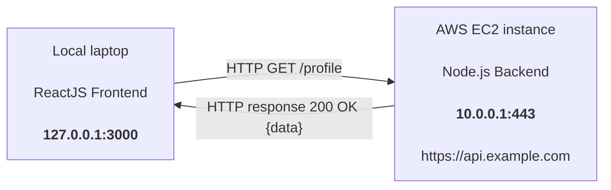

# What Really Happens When You Make an HTTP Request

## Local ReactJS Frontend → AWS EC2 Node.js Backend

- **127.0.0.1:3000** as Source IP
- **10.0.0.1:443** as Destination IP (This is public availble)
- 
