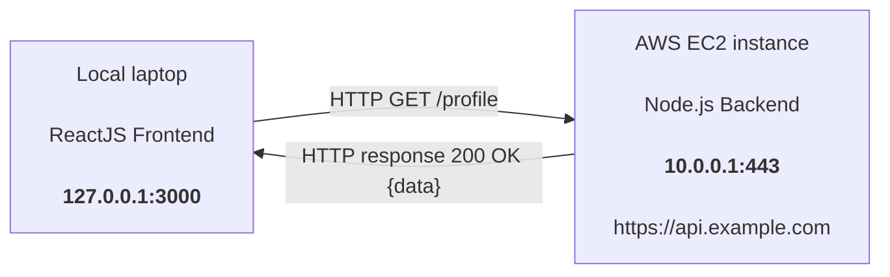

# Introduction

## Local ReactJS Frontend → AWS EC2 Node.js Backend

- **127.0.0.1:3000** as Source IP
- **10.0.0.1:443** as Destination IP (This is public availble)
- const res = await fetch("https://api.example.com/profile")
- What it Do
- Domain Name System(DNS) takes the host name (here - api.example.com) -> convert it to it's public IP address(Here : 10.0.0.1).
- Source Ip : 127.0.0.1
- Source port :3000
- Destination IP : 10.0.0.1
- Destination Port : 443
